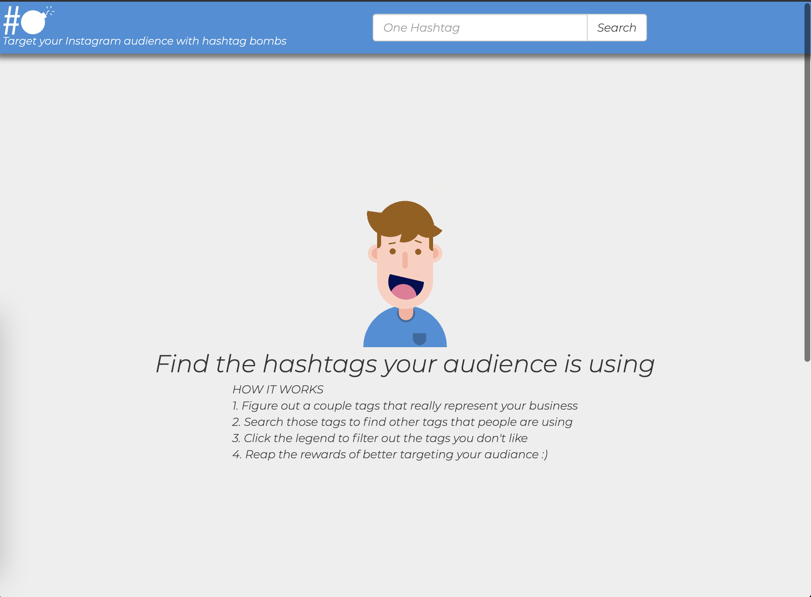

# Archived

This project relied on Instagram's public Graph API which deprecated on July 31, 2018.  Feel free to use this code however you would like. :)

# Hashtag Bomb Builder

Use instagram public API's to find the hashtags your audience is using



# Install Instructions

Note: My server is using an Apache HTTP Server so to host a python app you have to `mod_wigi`. This might not be the case for the server you're running

### Setup
```
virtualenv .venv
. .venv/bin/activate
```

### Install Deps
```
pip install -U -r requirments.txt
```

### Setup wsgi config
update `hashtagbombbuilder.wsgi` to the local path of your files
<!--
### Download Driver
```
wget https://github.com/mozilla/geckodriver/releases/download/v0.19.1/geckodriver-v0.19.1-linux64.tar.gz
``` -->

<!-- ### Untar driver and add it to `/usr/local/bin` -->
